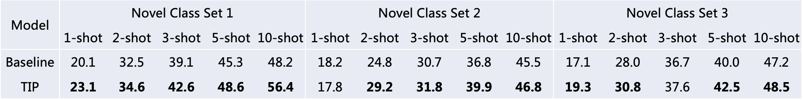
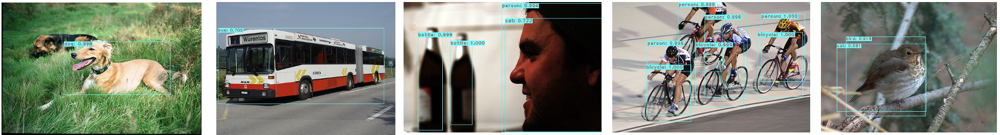
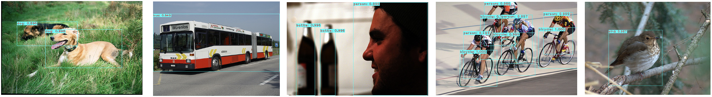
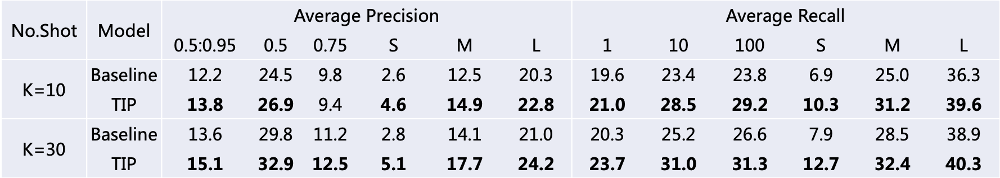
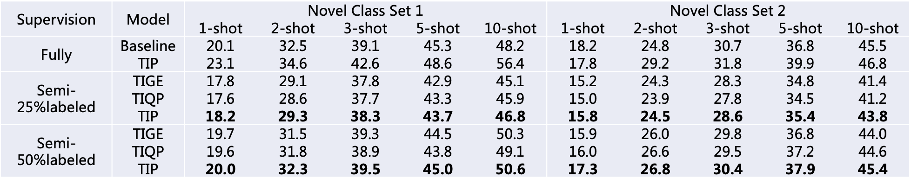
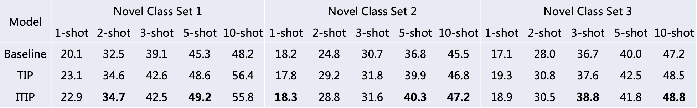
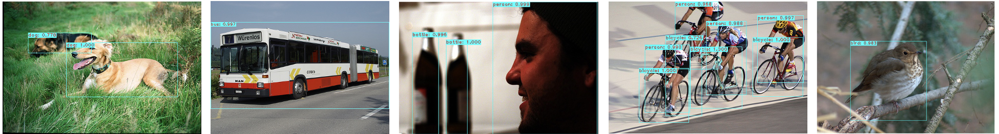

# 阶段一：论文复现

论文 [Transformation Invariant Few-Shot Object Detection](https://openaccess.thecvf.com/content/CVPR2021/papers/Li_Transformation_Invariant_Few-Shot_Object_Detection_CVPR_2021_paper.pdf) 代码复现。


## 目录

* [安装运行环境](#安装运行环境)
* [数据准备](#数据准备)
* [代码运行](#代码运行)
* [实验结果](#实验结果)

## 安装运行环境

该代码是基于论文 [Few-Shot Object Detection and Viewpoint Estimation for Objects in the Wild](https://github.com/YoungXIAO13/FewShotDetection#installation) 中的开源代码进行编写。

训练和测试均需要 GPU，本实验选择的 GPU 型号为：**Tesla P40 显存24GB**。

**部分 Requirements**

* CUDA 8.0（无法使用最新版本CUDA）
* Python=3.6
* PyTorch=0.4.0
* torchvision=0.2.1
* OpenCV=3.4.2
* gcc >= 5.5.0

**构建运行环境**

* 创建 Conda 虚拟环境：

```sh
conda create --name FSdetection --file requirements.txt
source activate FSdetection
```

* 编译 CUDA 依赖：

```sh
cd ./lib
sh make.sh
```

## 数据准备

论文是基于两个常见的目标检测数据集 PASCAL VOC 和 MSCOCO 进行实验的。

对于 **PASCAL VOC** 数据集，VOC 07 和 VOC 12 共由来自 20 个不同类别的 16.5k train-val 和 5k test 图像组成。本实验使用 VOC 07 和 VOC 12 的 train-val 作为**训练集**，VOC 07 的 test 作为**测试集**，将这 20 个类别划分为 **15个 base classes** 和 **5个 novel classes**，总共使用三种不同的划分方法依次进行实验；

对于 **MSCOCO** 数据集，它由来自 80 个不同类别的 80k train、40k validation 和 20k test 图像组成。本实验使用 COCO 2014 的 5k minval 图像作为**测试集**评估模型效果，剩下的 35k train-val 图像作为**训练集**，将这 80 个类别划分为 **60 个 base classes** 和 **20 个 novel classes**，其中，20 个 novel classes 与 PASCAL VOC 中的 20 个类别相同。

下面介绍如何从官网下载这两个数据集：

### PASCAL VOC

执行如下命令，进入 data 文件夹：

```bash
cd ./data
```

下载 VOC 07 train-val：

```bash
wget http://host.robots.ox.ac.uk/pascal/VOC/voc2007/VOCtrainval_06-Nov-2007.tar
tar xvf VOCtrainval_06-Nov-2007.tar && rm VOCtrainval_06-Nov-2007.tar 
```

下载 VOC 07 test：

```bash
wget http://host.robots.ox.ac.uk/pascal/VOC/voc2007/VOCtest_06-Nov-2007.tar
tar xvf VOCtest_06-Nov-2007.tar && rm VOCtest_06-Nov-2007.tar
```

下载 VOC 12 train-val：

```bash
wget host.robots.ox.ac.uk/pascal/VOC/voc2012/VOCtrainval_11-May-2012.tar
tar xvf VOCtrainval_11-May-2012.tar && rm VOCtrainval_11-May-2012.tar 
```

得到如下目录结构：

```
data/VOCdevkit
    VOC{2007,2012}/
        Annotations/
        ImageSets/
        JPEGImages/
        SegmentationClass/
        SegmentationObject/
```

其中，SegmentationClass 和 SegmentationObject 文件夹本实验未使用

将划分数据集的 txt 文件移动到对应路径：

```bash
mv  VOCsplits/VOC2007/*  VOCdevkit/VOC2007/ImageSets/Main/
mv  VOCsplits/VOC2012/*  VOCdevkit/VOC2012/ImageSets/Main/  
```

至此，PASCAL VOC 数据集准备完成。

### COCO

执行如下命令，进入 data 文件夹，建立 coco 文件夹并在其中建立 images 文件夹：

```bash
cd ./data
mkdir coco
cd coco
mkdir images
```

下载 COCO 2014 train：

```bash
wget images.cocodataset.org/zips/train2014.zip
unzip train2014.zip && rm train2014.zip
mv train2014 images/
```

下载 COCO 2014 val：

```bash
wget images.cocodataset.org/zips/val2014.zip
unzip val2014.zip && rm val2014.zip
mv val2014 images/
```

下载 COCO 2014 标注信息：

```bash
wget images.cocodataset.org/annotations/annotations_trainval2014.zip
unzip annotations_trainval2014.zip && rm annotations_trainval2014.zip
```

下载 [instances_minival2014.json](https://dl.dropboxusercontent.com/s/o43o90bna78omob/instances_minival2014.json.zip?dl=0) 和 [instances_valminusminival2014.json](https://dl.dropboxusercontent.com/s/s3tw5zcg7395368/instances_valminusminival2014.json.zip?dl=0) 移至 annotations 文件夹：

```bash
mv instances_minival2014.json annotations/
mv instances_valminusminival2014.json annotations/
```

得到如下目录结构：

```
data/coco
    annotations/
    images/
        train2014/
        val2014/
```

至此，COCO 数据集准备完成。

## 代码运行

### 1. Base Training

在 Base Training 阶段，使用 base classes 的整个训练数据集训练模型：

*  PASCAL VOC

```bash
# the first split on VOC
bash run/train_voc_first.sh

# the second split on VOC
bash run/train_voc_second.sh

# the third split on VOC
bash run/train_voc_third.sh
```

* MSCOCO

```bash
# COCO
bash run/train_coco.sh
```

得到如下预训练模型目录结构：

```
save_models/
    COCO/
    VOC_first/
    VOC_second/
    VOC_third/
```

### 2. Finetuning 

在 Finetuning 阶段，在预训练模型的基础上，从 novel classes 中增加 few-shot 样本继续进行训练。

为了平衡 base classes 和 novel classes 的训练样本，从整个训练数据集中为每个 base class 随机选择 K 个标记实例，并将它们与样本较少的 novel classe 结合起来，形成一个新的 finetuning 数据集。

*  PASCAL VOC

```bash
# the first split on VOC
bash run/finetune_voc_first.sh

# the second split on VOC
bash run/finetune_voc_second.sh

# the third split on VOC
bash run/finetune_voc_third.sh
```

* MSCOCO

```bash
# COCO
bash run/finetune_coco.sh
```

### 3. Testing

在 PASCOL VOC 和 MSCOCO 数据集上评价测试结果。

* PASCAL VOC

VOC 07 的 test 作为测试集来评估模型效果：

```bash
# the first split on VOC
bash run/test_voc_first.sh

# the second split on VOC
bash run/test_voc_second.sh

# the third split on VOC
bash run/test_voc_third.sh
```

* MSCOCO

COCO 2014 的 minval 作为测试集来评估模型效果：

```bash
# coco
bash run/test_coco.sh
```


## 实验结果

### 标准 FSOD

**PASCAL VOC(AP@50)**

总共包含三种不同的 base/novel classes 划分方式，IoU 的阈值设置为 0.5，下表为实验结果：



其中，Baseline 为论文 [Few-Shot Object Detection and Viewpoint Estimation for Objects in the Wild](https://github.com/YoungXIAO13/FewShotDetection#installation) 中所使用的模型，TIP为复现论文中所使用到的模型。

在 PASCAL VOC 数据集上 Baseline 实验结果可视化：



TIP 实验结果可视化：



**COCO**

在 COCO 数据集的实验结果如下表所示：



其中，K 代表 Shots 的个数。

### 半监督 FSOD

**PASCAL VOC(AP@50)**

在半监督 FSOD 场景下，三种不同划分方式的 PASCAL VOC 数据集实验结果如下表所示：




Supervision 一列中，Fully 为标准 FSOD，Semi-25%labeled 代表 base classes 中 25% 的图像有标签，Semi-50%labeled 代表 base classes 中 50% 的图像有标签；Model 一列中，TIGE 为 Baseline 的基础上增加了引导向量的转换一致性，TIQP 为 Baseline 的基础上增加了查询图像的转换一致性。

# 阶段二：转换一致性的扩展

在复现论文 [Transformation Invariant Few-Shot Object Detection](https://openaccess.thecvf.com/content/CVPR2021/papers/Li_Transformation_Invariant_Few-Shot_Object_Detection_CVPR_2021_paper.pdf) 的基础上，尝试将 TIP 应用到目标检测的其它模块。

对原有 TIP 方法进行改进，设计如下网络结构：


即在原 TIP 的基础上，增加 TFMC Loss(Transformed Feature Map Consistency Loss)，使得查询预测分支中同一图像的 feature map 更加聚集，从而更加有利于后续的目标检测。

**安装运行环境、数据准备和代码运行**均与阶段一相同，下面展示实验结果。

## 实验结果

**PASCAL VOC(AP@50)**

三种不同划分方式的 PASCAL VOC 数据集实验结果如下表所示：



其中，**ITIP** 为原 TIP 方法的改进，即上述提到的增加 TFMC Loss。

在 PASCAL VOC 数据集实验结果可视化：


